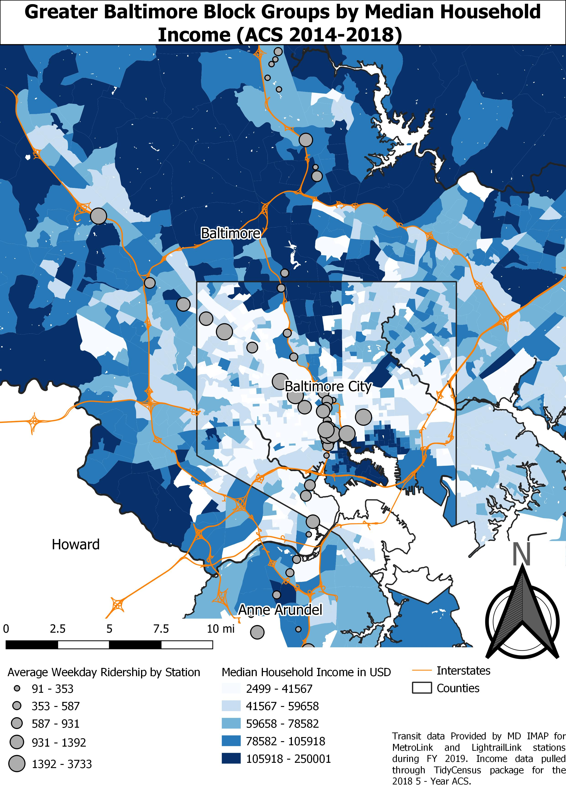
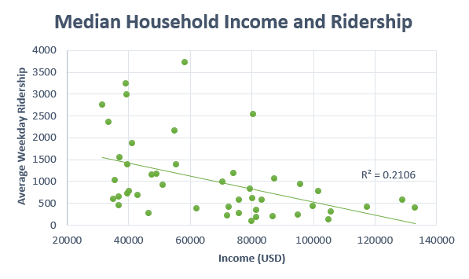
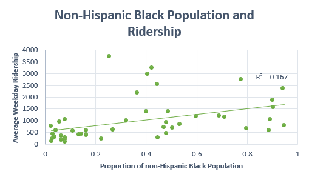
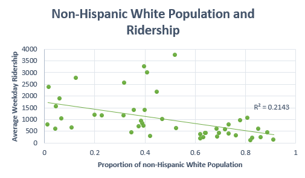
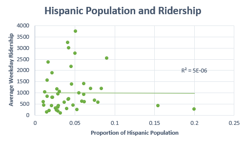

## Baltimore Transit Study: Metro and Light Rail Buffers with Demographics

**Project description:** This project was an update/continuation of the GES 486 Baltimore Lightrail project I produced earlier in the semester. This project looks at both the Lightrail Link and Metro Link systems together and pulls additional demographic information for the new transit layer. 
### Analysis
The same block group level data collected from the ACS for 2014 through 2018, for the counties of Baltimore and Anne Arundel plus Baltimore City, was used for the basemap with Metro and Lightrail Link stations symbolized by station ridership using graduated symbol size.

My spatial analysis was conducted using 0.5 mile buffers around the Metro/Lightrail layer that was spatially joined to the block group data. Similarly, to Project 1, the data was joined by summarizing all intersecting block groups by averaging median household income. The additional variables for non-Hispanic White, non-Hispanic Black, and Hispanic populations as well as housing units were also averaged for each station.

### Results

Median household income per block group in the greater Baltimore City area with Lightrail and Metro Link stations symbolized by weekday ridership.
  

The new median household income vs. ridership chart with additional Metro Link data.

The addition of the Metro Link to the Lightrail data helped strengthen the case for the model that Lightrail and Metro Link stations with intersecting block groups with lower median household incomes tend to have a higher average weekday ridership. The R squared value for this model suggests that at least 20% of the time this may be the case. Going further into the data, the relationship between station’s non-Hispanic White population and ridership had an R squared value of 0.2143 and 0.167 for the non-Hispanic Black population. Interestingly enough, the R squared value for the Hispanic population and ridership was extremely low, at 5E^-6, the relationship generally does not fit the model that possibly describes income and the non-Hispanic White and Black populations. 

**Source:**
Wang, K., & Woo, M. (2017, July 27). The relationship between transit rich neighborhoods and transit ridership: Evidence from the decentralization of poverty. Retrieved from https://www.sciencedirect.com/science/article/pii/S0143622817307166

