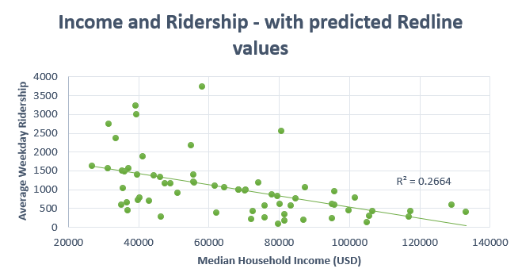
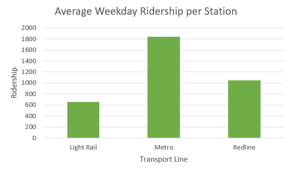

## Baltimore Transit Study: The Baltimore Redline - GES 486

**Project description:** Wrapping up a study done on the function of transportation in Baltimore wouldn't be complete without revisiting the proposed Baltimore Redline, a transport project that was cancelled in 2015. The Line would have served 19 stations from the west to east through downtown Baltimore connecting it with other MARC, Lightrail, and Metro stations (La Noue, 2015).

### Analysis
A map of the proposed Baltimore Redline map (source: https://comebackcity.us/2013/03/10/baltimore-better-with-red-line/) was georeferenced and stations were plotted as a point using the approximate locations from the map. It is important to note that these locations are approximate with both inaccuracies from georeferencing and the map being somewhat generalized. 

As was done for the previous analyses, intersecting block group data was summarized from a 0.5 mile buffer around these stations. Using the data gathered from intersecting block groups station ridership would then be interpolated using demographic-ridership trends from existing stations. Since median household income had a stronger relationship with ridership than some ethnicity/race data and is a single category measure, it was decided that this variable may be best for predicting ridership numbers for Redline stations. Values were interpolated using the FORCAST.LINEAR function in Excel. The values were checked by looking at the new R squared value which was slightly higher at 0.2664 but around the same values without the Redline stations which was between almost 0 and 0.2143 depending on the demographic. 

### Results

Median household income per block group in the Baltimore City with Lightrail, Metro, and the newly added Redline stationing.
  

Adjusted Median Household Income using interpolated values for the Redline
  
  
Average station ridership by transport line using interpolated values for the Redline

The Redline is of an intermediate size between the 14 station Metro and 33 station Lighrail. The interpolated ridership puts the line between the Metro and Lightrail in terms of an average station weekday ridership at around 1049 where the metro is currently at 1845 and the Lightrail only 675 (see graph above). This puts the projected ridership at just around the mean/IQR (around 900). 

 [Live here](../GES_486_Project_3/qgis2web_2020_05_12-15_52_03_111866/index.html) is the new online webmap that provides station-by-station data on Lightrail (blue), Metro (green), and Redline (red) stops. By hovering over these stations, box plots will update in the legend to show relative population, income, and ridership data.

**Sources:**
Wang, K., & Woo, M. (2017, July 27). The relationship between transit rich neighborhoods and transit ridership: Evidence from the decentralization of poverty. Retrieved from https://www.sciencedirect.com/science/article/pii/S0143622817307166

Noue, Jeff La. “Baltimore's Red Line Connects More than You May Think.” Greater Greater Washington, Greater Greater Washington, 5 Feb. 2015, ggwash.org/view/37092/baltimores-red-line-connects-more-than-you-may-think.

Corely, Grant. “Baltimore Better with Red Line.” Comeback City, 15 Mar. 2013, comebackcity.us/2013/03/10/baltimore-better-with-red-line/.
