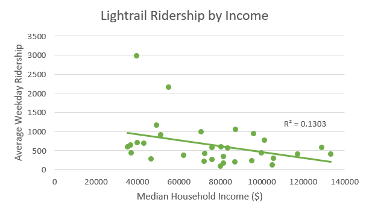

## Baltimore Lightrail Study

**Project description:** Based off the transit study done in Atlanta GA by Kyungsoon Wang and Myungje Woo with the School of City and Regional Planning, Georgia Institute of Technology, and Department of Urban Planning and Design, University of Seoul, I took a look at Baltimore's Lighrail ridership and median household income of the area surrounding each station. While this is a higher level overview than the original study, the patterns and findings could lead to a more statistically intense (and therefore significant) study done at the same level of the 2017 Atlanta MARTA study.
### Analysis
Block Group level data was collected from the ACS for 2014 through 2018 for the counties of Baltimore and Anne Arundel as well as Baltimore City. Data for all stations of the Baltimore Lightrail system were also gathered from Maryland State's IMAP service which is an open data platform. 

I started by producing a map which displayed 5 classes for the median household income at the block group level for the greater Baltimore area. I continued my analysis by producing a 0.5 mile buffer around the lightrail stations. I then did a summary-based spatial join with each station and all intersecting block groups where the median household income between all intersecting block groups was averaged into one number representing the area surrounding the station. These variables were then mapped separately but the relationship between income and lightrail ridership were plotted for analysis.

### Results

Block group level income data for Anne Arundel and Baltimore Counties as well as Baltimore City divided into five classes by quantile.

Lightrail 0.5 mile station buffers by ridership

Overall, through the geospatial analysis, the busiest stations appear to be in the center of the city and at the main termini (BWI, Cromwell, and Timonium Fairgrounds). BWI, being an airport, has no block group level data for income within a 0.5 mile radius but also most likely receives a different clientele than the other stations which are commuter/resident based. The income distribution differs from the Atlanta case where Atlanta has experienced more of a decentralization of poverty and Baltimore, compared to outlying countries, has lower income block groups towards the inner-city areas.

When looking at income and ridership, there is a tendency for lower income areas to show higher ridership numbers than higher income areas with thr exception of terminating stations. However the R squared value of .13 suggest this only partially may be the case and a further analysis should be done to examine other dependencies.

**Source:**
Wang, K., & Woo, M. (2017, July 27). The relationship between transit rich neighborhoods and transit ridership: Evidence from the decentralization of poverty. Retrieved from https://www.sciencedirect.com/science/article/pii/S0143622817307166

