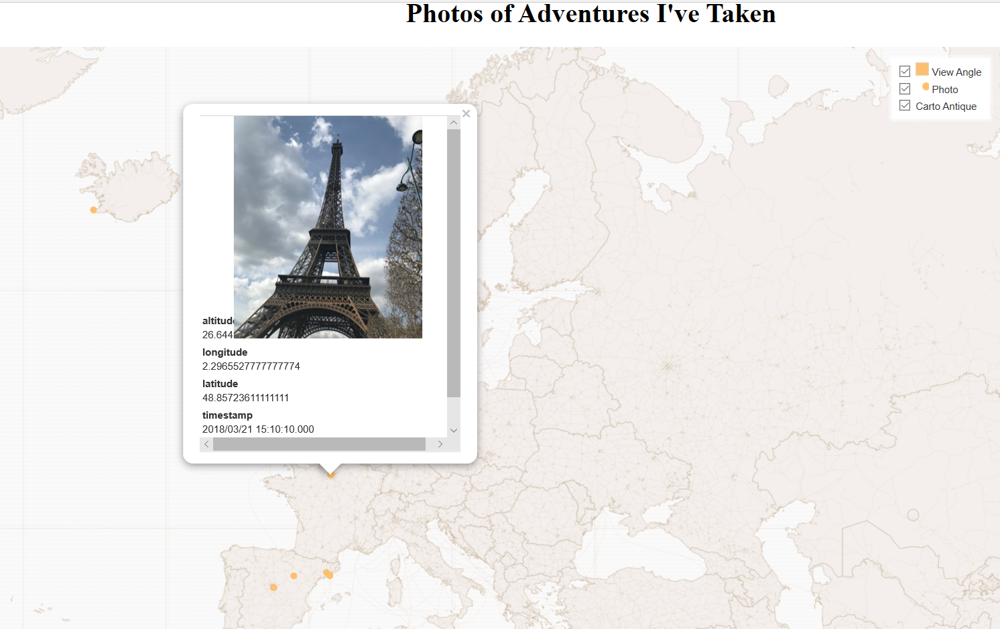

[World Photo Map](projects/qgis2web_2020_02_25-10_33_20_132185/index.html)

This map shows photos from different trips I have gone on recently. There is also a layer that shows the "field of view" created from wedge buffers using the photo's orientation (Idea from: https://communityhealthmaps.nlm.nih.gov/2019/02/21/mapping-field-photos-in-qgis/). Some of the landscape oriented photos are sideways so I am still working on that  ¯\_(ツ)_/¯.
