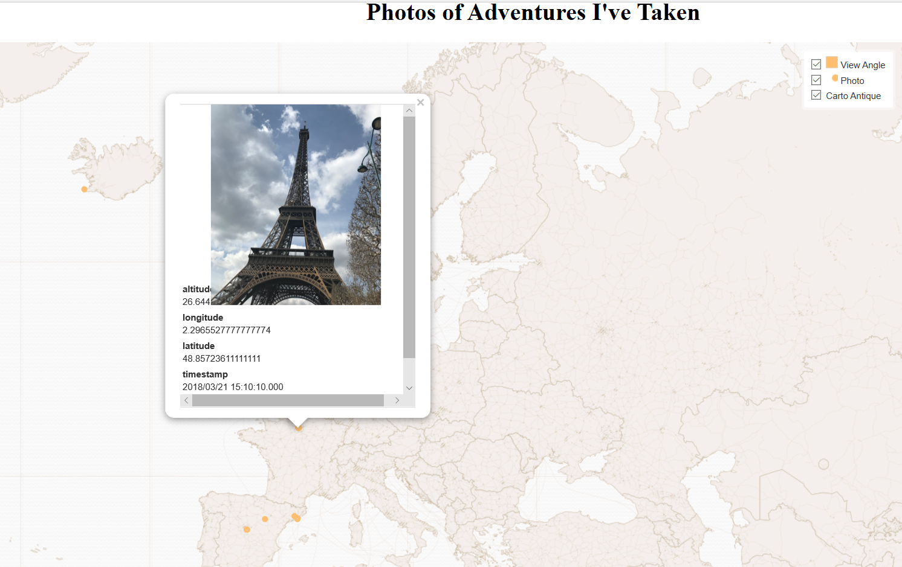

## My Work

---

### GES Projects

[Baltimore Transit Study: Part 2](GES_486_Project_2/Baltimore_Transit_Study_2.md)

[COVID-19 Tweet Map](Lab_6/lab_6_Warner.md)

A map of the U.S. comparing the amount of tweets about the COVID-19 Pandemic and the economy.

---

[Baltimore Lightrail Study](Project1_486/Baltimore_transit_study.md)

Project 1 for GES 486 - Advanced GIS

---

[World Photo Map](projects/qgis2web_2020_02_25-10_33_20_132185/index.html)

This map shows photos from different trips I have gone on recently. There is also a layer that shows the "field of view" created from wedge buffers using the photo's orientation (Idea from: https://communityhealthmaps.nlm.nih.gov/2019/02/21/mapping-field-photos-in-qgis/). Some of the landscape oriented photos are sideways so I am still working on that  ¯\_(ツ)_/¯.

---

[Bahamas Fire Project (Data-MODIS Burned Area Product)](pdf/381 Final Presentation.pdf)

This project was to look at fire regimes in the Bahamas through remote sensing and GIS

---
[Habitat Determination](/Habitat_Determination.md)

This project was done as a test of GIS skills during the 2019 Fall semester at UMBC

---

### Additional Positions/Honors

- [MDOT Fellowship](https://publicservicescholars.umbc.edu/mdot-fellows-2019/)
- [UMBC Career Center Intern of the Week](https://careers.umbc.edu/news/?id=90220)

---

---

Page template forked from <a href="https://github.com/evanca/quick-portfolio">evanca</a>

<!-- Remove above link if you don't want to attibute -->
